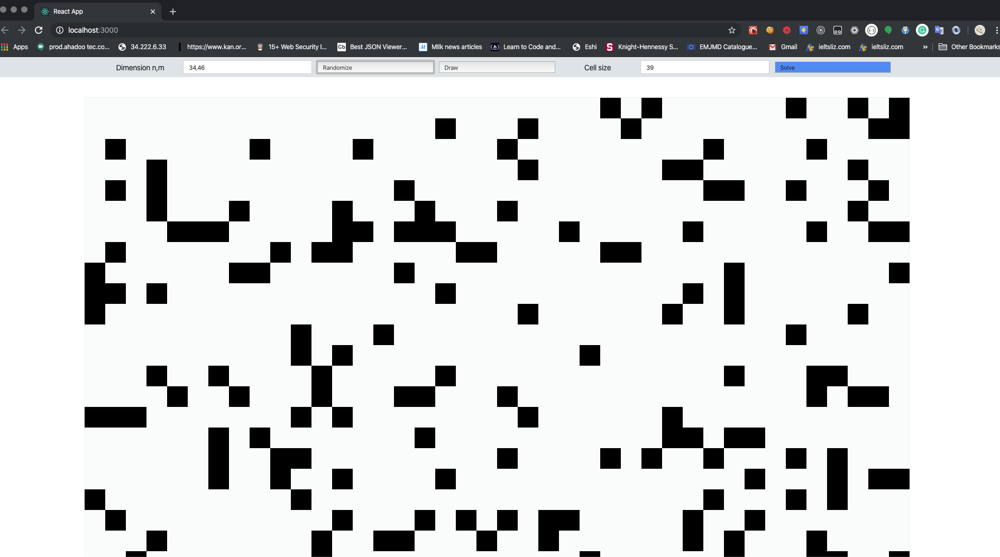
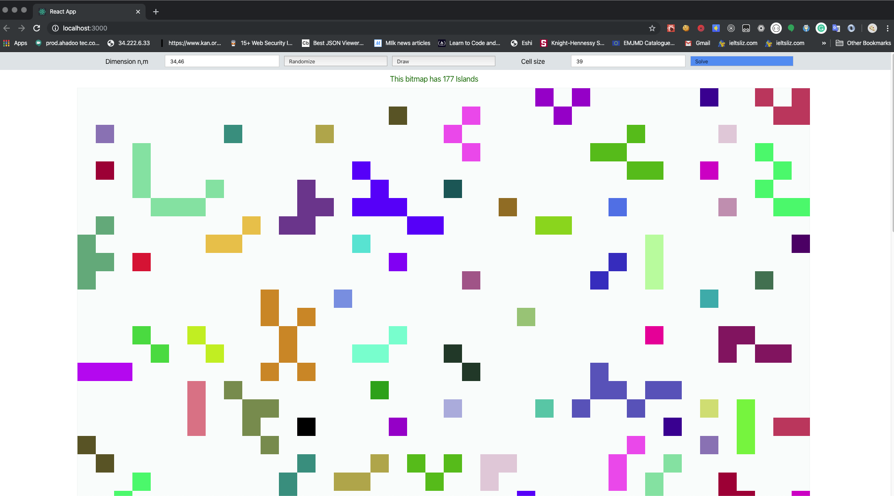

This project was bootstrapped with [Create React App](https://github.com/facebook/create-react-app).


## How to test the application 

 1. Change bitmap dimension 
 
        simply change the dimension by writing two integers separated by a delimiter  
 
 2. Randomize
        
        Hit Randomize to create a random bitmap
 
     
 3. Draw 
        
        Hit  Draw each time you want to draw by  draging on the board.
 
   
 4. Cell Size 
  
        Change the size of each cell in the board by changing this value. 
        Valid values are 2  up to  40. meaning the smallest cell is 2px square and the biggest is 40px square.
        
 
 5. Solve 
 
         Hit solve to ge number of islands at any point. 
 
 
    On changing the values like cell size and dimension the app will
    update it slef when you stop typing / on loosing focus.

 
 6. Density : update the config file if you want play with the density
           
        This requires updating the config file. 
        Density is how sparse the labelled cells are in the bitmap.
        Valid values are  (0.6 - 0.9)


## How to run 
 
 ```$xslt
> npm start 

or
 
> s 

```


Now visit  http://localhost:3000/ 


## Sample Input for n,m = 34,56 with cell Size = 29 



## Sample output  for n,m = 34,56 with cell Size = 29 




## Available Scripts


In the project directory, you can run:

### `yarn start`

Runs the app in the development mode.<br />
Open [http://localhost:3000](http://localhost:3000) to view it in the browser.

The page will reload if you make edits.<br />
You will also see any lint errors in the console.

### `yarn test`

Launches the test runner in the interactive watch mode.<br />
See the section about [running tests](https://facebook.github.io/create-react-app/docs/running-tests) for more information.

### `yarn build`

Builds the app for production to the `build` folder.<br />
It correctly bundles React in production mode and optimizes the build for the best performance.

The build is minified and the filenames include the hashes.<br />
Your app is ready to be deployed!

See the section about [deployment](https://facebook.github.io/create-react-app/docs/deployment) for more information.

### `yarn eject`

**Note: this is a one-way operation. Once you `eject`, you can’t go back!**

If you aren’t satisfied with the build tool and configuration choices, you can `eject` at any time. This command will remove the single build dependency from your project.

Instead, it will copy all the configuration files and the transitive dependencies (Webpack, Babel, ESLint, etc) right into your project so you have full control over them. All of the commands except `eject` will still work, but they will point to the copied scripts so you can tweak them. At this point you’re on your own.

You don’t have to ever use `eject`. The curated feature set is suitable for small and middle deployments, and you shouldn’t feel obligated to use this feature. However we understand that this tool wouldn’t be useful if you couldn’t customize it when you are ready for it.

## Learn More

You can learn more in the [Create React App documentation](https://facebook.github.io/create-react-app/docs/getting-started).

To learn React, check out the [React documentation](https://reactjs.org/).

### Code Splitting

This section has moved here: https://facebook.github.io/create-react-app/docs/code-splitting

### Analyzing the Bundle Size

This section has moved here: https://facebook.github.io/create-react-app/docs/analyzing-the-bundle-size

### Making a Progressive Web App

This section has moved here: https://facebook.github.io/create-react-app/docs/making-a-progressive-web-app

### Advanced Configuration

This section has moved here: https://facebook.github.io/create-react-app/docs/advanced-configuration

### Deployment

This section has moved here: https://facebook.github.io/create-react-app/docs/deployment

### `yarn build` fails to minify

This section has moved here: https://facebook.github.io/create-react-app/docs/troubleshooting#npm-run-build-fails-to-minify
